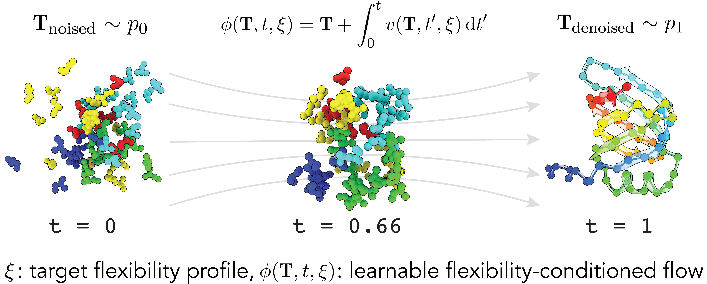
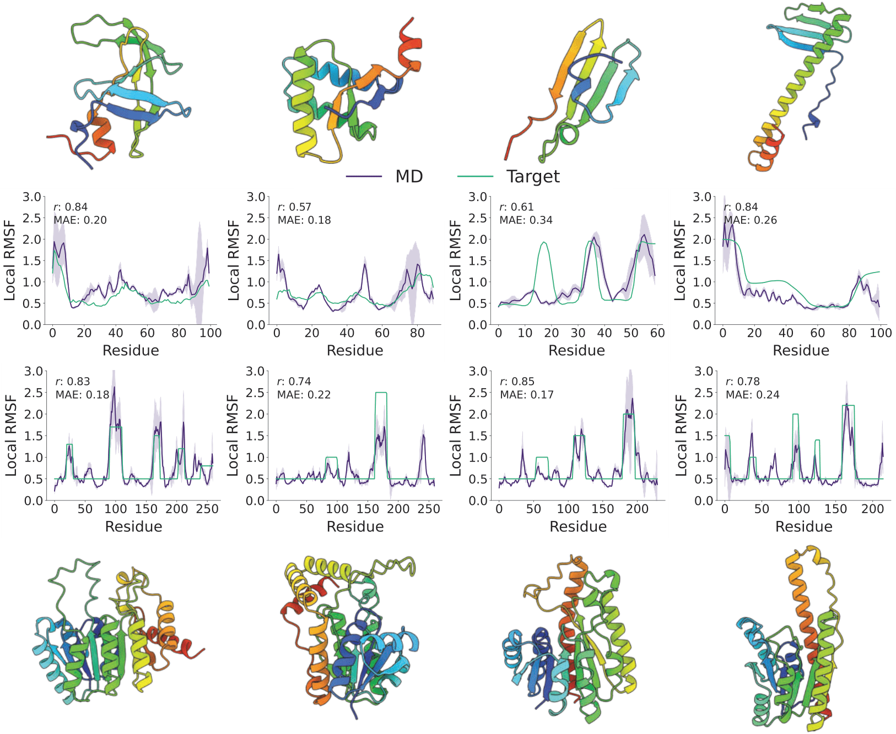

# FliPS - Flexibility Conditioned Protein Structure Generation



## Description

**FliPS** is a generative model for designing proteins with given per-residue flexibility described in the paper [Flexibility-conditioned protein structure design with flow matching](https://openreview.net/forum?id=890gHX7ieS).

This repository relies on the [GAFL](https://github.com/hits-mli/gafl) package and code from [FrameFlow](https://github.com/microsoft/protein-frame-flow).

---

<details open><summary><b>Table of contents</b></summary>
  
- [Quickstart](#quickstart)
- [Colab Tutorial](#google-colab-tutorial)
- [Inference](#inference)
- [Installation](#installation)
- [Datasets](#datasets)
- [Training](#training)
- [Citation](#citation)
</details>

## Quickstart

You can use our installation script (here for torch version 2.6.0 and cuda 12.4), which essentially executes the steps specified in the section **pip** below:

```bash
git clone https://github.com/graeter-group/flips.git
git clone https://github.com/graeter-group/backflip.git
conda create -n flips python=3.10 pip=23.2.1 -y
conda activate flips && bash flips/install_utils/install_via_pip.sh 2.6.0 124
```

Verify your installation by downloading the model weights and running our example script:

```bash
wget --content-disposition https://keeper.mpdl.mpg.de/f/236758d218a748fe93cd/?dl=1 -P ckpt/paper_weights
bash flips/scripts/inference_example.sh
```

For more details and alternative installation methods, please take a look at the [Installation](#installation) section.

## Google Colab Tutorial

We provide a [Google Colab notebook with a tutorial for generating flexibility-conditioned protein structures](https://colab.research.google.com/drive/1Pc3xwgI6PO975b04NLuJhuEUWkg860V_?usp=sharing), for which no local installation is required.

## Inference

<div align="center">
  
  <p style="width: 80%; font-size: 12px; text-align: center; margin: auto;">
    <em>
      FliPS generates protein structures whose MD-derived flexibility resemble a given target profile provided by the user. 
    </em>
  </p>
</div>

### Generating protein structures

To generate protein structures conditioned on an input flexibility profile, first follow the installation procedure as described below. 

After succesful installation, download the pre-trained model weights,
```bash
wget --content-disposition https://keeper.mpdl.mpg.de/f/236758d218a748fe93cd/?dl=1 -P ckpt/paper_weights
```

Inference can be run by executing:

```bash
python experiments/inference.py --config-name inference_flex
```

This executes inference with the conditional model **conditioned on an exemplary input flexibility profile** which we provide. To pass your own profile and change inference settings, please see instructions below.

### 🔧 Customizing inference configs

FliPS loads model and inference configuration from a .yaml config. This config controls how structures are sampled. Config can be found at **`configs/inference_flex.yaml`**:

#### Key Arguments

- **`backflip_screening`**:
  Whether to compute flexibility similarity metrics to the target profile with BackFlip.

- **`flex_profile`**: (e.g.) `./flex_profiles/example_profile_small.txt`  
  Path to the 1D flexibility profile used to guide backbone generation.

- **`min_length`**:
  Minimum length of sampled backbones.

- **`max_length`**:
  Maximum length of sampled backbones.

- **`length_step`**:
  Step size for lengths to sample.

- **`num_samples`**:
  Number of backbone samples to generate per target length.

- **`run_self_consistency`**:
  Whether to run self-consistency with ProteinMPNN and ESMfold. If set to `True`, the script will generate sequences for the sampled backbones and fold them back to compute self-consistency metrics.

- **`num_top_samples`**:
  Number of top-samples (w.r.t. flex profile) to select for sequence design and folding. Has no effect if run_self_consistency is set to `False`.

- **`pass_flex_condition`**:
  Whether to pass flexibility profile to the model as a condition (can be used for ablating vs unconditonal generation), equivalent to turning off both BackFlip guidance and classifier free guidance.

#### Unconditional generation

To perform unconditional generation, in the inference config config set `cfg_scale: 0.0`, turning off `classifier_free_guidance`.

### BackFlip Guidance (BG)

Alternative to the conditional model, we implemented a BackFlip guidance (BG) strategy. BG approximates conditional flow by guiding the unconditional model with predictions made by BackFlip. BG can be switched on by setting `cg_scale != 0` in the inference config. It yields worse results than sampling with the conditional model but can be used also with other generative models without requiring retraining. For more details we refer to the paper.

### Self-consistency with ProteinMPNN and ESMfold

FliPS generates only protein backbones and relies on inverse folding models to obtain a sequence. To run the self-consisency pipeline, please first clone [ProteinMPNN](https://github.com/dauparas/ProteinMPNN) into the flips folder:

```bash
cd ../ && git clone https://github.com/dauparas/ProteinMPNN.git
```

To install [ESMfold](https://github.com/facebookresearch/esm), run in the flips folder:

```bash
pip install deepspeed==0.6.7
bash scripts/correct_deepspeed.sh
pip install fair-esm==2.0.0
```

To run self consistency, in the inference config point to the directory where ProteinMPNN was cloned with `pmpnn_dir:<path>` (default is `../ProteinMPNN`) and set `run_self_consistency` to `True`. Further options can be found in the example script `scripts/inference_refolding.sh`.

### Analyze Flexibility Metrics

To compute flexibility similarity metrics of the generated protein structures to the target flexibility profile and evaluate their designability, run:

```python
python flips/analysis/get_flex_results.py --results_folder <path> --num_top_samples <int>
```

If you ran inference with `run_self_consistency` to `True` and wish to evaluate self-consisencty metrics of the generated samples, pass 

```
--compute_designability
```

#### Optional: Compute Structural Novelty

If Foldseek is installed (see [FoldSeek](https://github.com/steineggerlab/foldseek)), you can also compute the novelty of the generated backbones by adding the following arguments:

```
--compute_novelty --dataset_foldseek <path>
```

---

## Installation

For convenience, you can use the installation script as explained in the [Quickstart](#quickstart) section. It essentially executes the pip installation described below. If it fails, we recommend to follow the steps below and debug where needed.

### pip

Optional: Create a virtual environment, e.g. with conda and install pip23.2.1:

```bash
conda create -n flips python=3.10 pip=23.2.1 -y
conda activate flips
```

Install the dependencies from the requirements file:

```bash
git clone https://github.com/graeter-group/flips.git
pip install -r flips/install_utils/requirements.txt

# FliPS builds on top of the GAFL and BackFlip packages, which are installed from source:
git clone https://github.com/hits-mli/gafl.git
cd gafl
bash install_gatr.sh # Apply patches to gatr (needed for gafl)
pip install -e . # Install GAFL

cd ..
git clone https://github.com/graeter-group/backflip.git
cd backflip && pip install -e . # Install BackFlip

# Finally, install FliPS with pip:
cd flips && pip install -e .
```

Install torch with a suitable cuda version, e.g.

```bash
pip install torch==2.6.0 --index-url https://download.pytorch.org/whl/cu124
pip install torch-scatter -f https://data.pyg.org/whl/torch-2.6.0+cu124.html
```

where you can replace cu124 by your cuda version, e.g. cu118 or cu121.

### conda

FliPS relies on the [GAFL](https://github.com/hits-mli/gafl) package, which can be installed from GitHub as shown below. The dependencies besides GAFL are listed in `install_utils/environment.yaml`, we also provide a minimal environment in `install_utils/minimal_env.yaml`, where it is easier to change torch/cuda versions.

```bash
# download flips:
git clone https://github.com/graeter-group/flips.git
# create env with dependencies:
conda env create -f flips/install_utils/minimal_env.yaml
conda activate flips

# install gafl:
git clone https://github.com/hits-mli/gafl.git
cd gafl
bash install_gatr.sh # Apply patches to gatr (needed for gafl)
pip install -e .
cd ..

git clone https://github.com/graeter-group/backflip.git
cd backflip && pip install -e . # Install BackFlip

# install flips:
cd flips
pip install -e .
```

---

## Datasets

As explained in our paper, we first trained FliPS on the flexibility-annotated SCOPe dataset and continued on the PDB dataset. Datasets can be downloaded in the current folder by running:

```
wget --content-disposition https://keeper.mpdl.mpg.de/f/6365ec4a04d04af3af79/?dl=1 # For SCOPe dataset.
wget --content-disposition https://keeper.mpdl.mpg.de/f/7d1d94367db64c6eb8d6/?dl=1 # For PDB dataset.
```

After the download, untar the datasets and update the location of the structural files (.pkl or .npz) in the `metadata.csv`:

```
tar -xvf <path>.tar
python flips/data/update_metadata.py --csv_file <path_to_csv>
```

## Training

To train a flexibility-conditional model on the flexibility-annotated PDB or SCOPe datasets we provide, run:

```python
python experiments/train.py --config-path ../configs --config-name train data.dataset.csv_path=<path_to_csv>
```

All further flags and training parameters can be found in the `configs/train.yaml` and `configs/data/default.yaml`

---

## Common installation issues

If you encounter problems with the cuda version, you can also install the requirements from a minimal conda enviroment, modified to contain your torch and cuda version of choice:

```bash
# ...
conda env create -f flips/install_utils/minimal_env.yaml
conda activate flips
# ...
```

Problems with torch_scatter can usually be resolved by uninstalling and re-installing it via pip for the correct torch and cuda version, e.g. `pip install torch-scatter -f https://data.pyg.org/whl/torch-2.0.0+cu124.html` for torch 2.0.0 and cuda 12.4.

## Citation

```
@inproceedings{
viliuga2025flexibilityconditioned,
title={Flexibility-conditioned protein structure design with flow matching},
author={Vsevolod Viliuga and Leif Seute and Nicolas Wolf and Simon Wagner and Arne Elofsson and Jan St{\"u}hmer and Frauke Gr{\"a}ter},
booktitle={Forty-second International Conference on Machine Learning},
year={2025},
url={https://openreview.net/forum?id=890gHX7ieS}
}
```

The code relies on the [GAFL](https://github.com/hits-mli/gafl) package and code from [FrameFlow](https://github.com/microsoft/protein-frame-flow). It would be appreciated if you also cite the two respective papers if you use the code.
